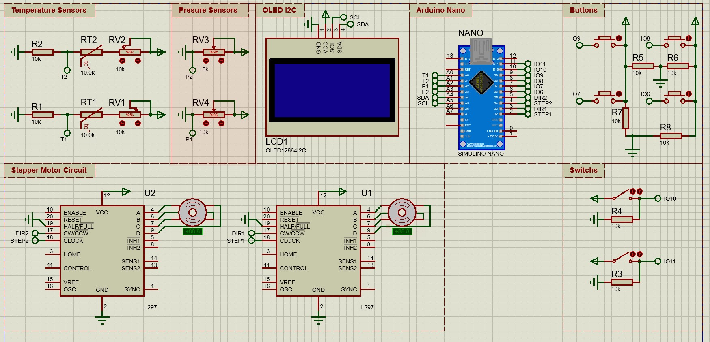

# Stepper Motors Valve Control System

 

## Description: 

#### The Arduino code are in **main** folder.

## Components:

### Using 1 Arduino Nano, 2 stepper motors, 1 OLED screen, 4 push buttons, 2 pressure sensors, and 2 temperature sensors.

| Pins to Arduino       | Description                                                  |
| --------------------- | ------------------------------------------------------------ |
| VCC -> 5v             | 5 volts For powering the components.                         |
| GND -> GND            | Ground for all the components.                               |
| SDA -> A4             | Serial Data pin for I2C communication between OLED display SSD1306 and Arduino Nano |
| SCL -> A5             | Serial Clock pin for I2C communication between OLED display SSD1306 and Arduino Nano |
| STEP1 - > 2           | Steps pin for stepper motor driver                           |
| DIR1 -> 3             | Direction pin for stepper motor driver                       |
| STEP2 - > 4           | Steps pin for stepper motor driver                           |
| DIR2 -> 5             | Direction pin for stepper motor driver                       |
| Push Button -> 6 to 9 | Push button for Control.                                     |
| T1,T2 -> A0, A1       | Temperature Sensors connection.                              |
| P1,P2 -> A2, A3       | Pressure Sensors connection.                                 |
| Switches -> 10,11     | Switches for controlling the modes for each stepper motor.   |